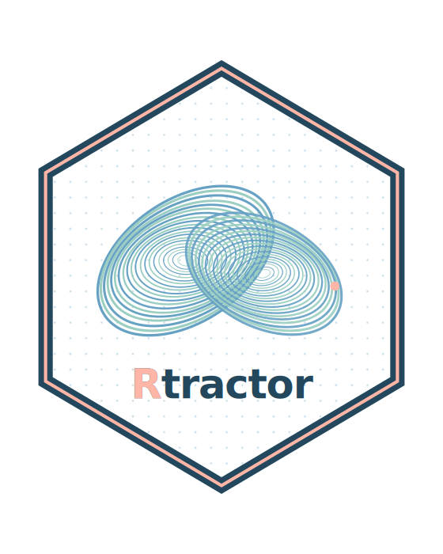

# 🦋 Rtractor 

**Complexity and nonlinear time series analysis for physiological signals — entropy, fractal/multifractal measures, Lyapunov exponents, multiscale metrics, and recurrence quantification analysis.**

[](https://circadia-bio.r-universe.dev/Rtractor)
[](https://doi.org/10.5281/zenodo.21328630)
[-blue.svg)](./LICENSE)
[](https://www.r-project.org/)
[](https://github.com/circadia-bio/Rtractor/actions/workflows/R-CMD-check.yaml)
[](https://github.com/circadia-bio/Rtractor/actions/workflows/pkgdown.yaml)
[](https://github.com/circadia-bio/Rtractor)
[](https://rtractor.circadia-lab.uk)

---

> [!WARNING]
> **Rtractor is in early development and several planned families are not yet implemented** (Lyapunov exponents, phase-space embedding, general recurrence quantification measures). Implemented functions have been validated against reference implementations or ground-truth synthetic data where one exists (see each function's documentation and `inst/COPYRIGHTS`), but the package as a whole has not undergone peer review and the API may change without notice. Verify outputs independently before using in any research context.

---

## 📖 What is Rtractor?

Rtractor is a shared "complexity toolkit" for the Circadia Lab / CoDe-Neuro
Lab ecosystem: a single home for the nonlinear dynamics and complex-systems
measures (entropy, fractal dimension, Lyapunov exponents, multiscale
entropy, recurrence quantification) that otherwise get reimplemented
piecemeal inside signal-specific packages like `mrpheus`, `zeitR`, and
`dynR`.

Like `hypnoR`, Rtractor is **signal-agnostic**: every metric accepts a plain
numeric time series regardless of where it came from — EEG, actigraphy,
BOLD, HRV, or anything else — rather than assuming a specific data source or
staging scheme.

Where possible, Rtractor wraps existing, well-validated C/C++/Fortran
reference implementations via Rcpp rather than reimplementing algorithms
from scratch in R, to preserve numerical parity with the original methods
literature.

## ✨ Planned features

- 🌀 **Entropy** — sample entropy, approximate entropy, permutation entropy
- 🌿 **Fractal & multifractal** — Higuchi dimension, box-counting, DFA, MFDFA
- 🦋 **Lyapunov exponents** — Rosenstein and Wolf methods
- 🔁 **Multiscale metrics** — multiscale entropy, refined composite MSE
- 🕸️ **Recurrence quantification analysis (RQA)** — recurrence plots,
  determinism, laminarity, and related measures
- 📐 **Phase-space embedding** — shared reconstruction utilities (embedding
  dimension, time delay) underlying the Lyapunov and RQA families
- 🎨 A dedicated Rtractor colour palette, ggplot2 scales, and
  `theme_rtractor()`

None of the Lyapunov metric functions are implemented yet. Currently
working: `dfa()`, `higuchi_fd()`, `mfdma()`, `chhabra_jensen()`,
`petrosian_fd()`, `hjorth_parameters()`, `num_zerocross()` (fractal
family), `perm_entropy()`, `sample_entropy()` (entropy family),
`multiscale_entropy()` (multiscale family), `recurrence_microstate_entropy()`
(RQA family), and `pmodel()` (simulate family, for generating synthetic
test signals). See `NEWS.md` for progress.

## 🗂️ Project Structure

```
Rtractor/
├── R/
│   ├── Rtractor-package.R   # package-level doc / Rcpp registration
│   ├── entropy.R            # perm_entropy(), sample_entropy()
│   ├── fractal.R            # dfa(), higuchi_fd(), mfdma(), chhabra_jensen(),
│   │                       # petrosian_fd(), hjorth_parameters(), num_zerocross()
│   ├── lyapunov.R           # planned: Rosenstein/Wolf
│   ├── multiscale.R         # multiscale_entropy(); planned: RCMSE
│   ├── rqa.R                # recurrence_microstate_entropy(); planned: RQA measures
│   ├── embed.R              # planned: phase-space reconstruction utils
│   ├── simulate.R           # pmodel() -- synthetic multifractal test signals
│   ├── palettes.R           # rtractor_palette(), rtractor_palettes()
│   ├── scales.R             # scale_{colour,fill}_rtractor(_c)()
│   └── theme.R              # theme_rtractor()
├── src/
│   ├── dfa.cpp              # DFA — wraps PhysioNet's dfa.c (GPL-2+)
│   ├── higuchi.cpp          # Higuchi FD — clean-room reimplementation
│   ├── fractal_multifractal.cpp  # MFDMA, Chhabra-Jensen — clean-room
│   ├── fractal_nonlinear.cpp     # Petrosian FD, Hjorth, zero-crossings — from mrpheus
│   ├── entropy.cpp          # Permutation entropy — from mrpheus
│   ├── sample_entropy.cpp   # Sample/multiscale entropy — wraps PhysioNet's mse.c (GPL-2+)
│   └── microstates.cpp      # Recurrence microstates entropy — wraps MIT code
├── inst/
│   └── COPYRIGHTS           # attribution for wrapped/ported reference code
├── vignettes/
│   ├── getting-started.Rmd       # tour of every implemented family
│   ├── multifractal-methods.Rmd  # mfdma() vs chhabra_jensen(), validated against pmodel() ground truth
│   └── entropy-and-complexity.Rmd  # perm_entropy/sample_entropy/multiscale_entropy, white noise vs correlated signal
├── tests/testthat/
├── man/
├── DESCRIPTION
└── NEWS.md
```

## 🚀 Getting Started

### Prerequisites

- R (>= 4.1.0)
- A C/C++ (and, where relevant, Fortran) toolchain for compiling the `src/`
  Rcpp components

### Installation

```r
# once published on r-universe:
install.packages("Rtractor", repos = c(
  "https://circadia-bio.r-universe.dev",
  "https://cloud.r-project.org"
))

# or directly from GitHub:
remotes::install_github("circadia-bio/Rtractor")
```

### Design principles

- **Signal-agnostic** — every function operates on a plain numeric vector
  (or matrix, for multivariate/embedded methods); no assumptions about
  acquisition modality.
- **Isolation principle** — Rtractor runs standalone with no dependency on
  any other Circadia Lab / CoDe-Neuro Lab package, so it can be adopted
  independently by other ecosystem packages as a leaf dependency.
- **Wrap, don't reimplement** — canonical C/C++/Fortran reference code is
  wrapped via Rcpp wherever a solid reference implementation exists, rather
  than re-derived in pure R.

## 📦 Dependencies

| Package | Purpose |
|---|---|
| Rcpp | Wrapping C/C++/Fortran reference implementations |
| ggplot2 (Suggests) | `theme_rtractor()` and the `scale_*_rtractor()` family |
| testthat (Suggests) | Unit testing |

## 👥 Authors

| Role | Name | Affiliation |
|---|---|---|
| Author, maintainer | Lucas França | Northumbria University, Circadia Lab |
| Author | Mario Leocadio-Miguel | Northumbria University, Circadia Lab |

## 📄 Citation

If you use Rtractor in your research, please cite it:

```bibtex
@software{franca_rtractor_2026,
  author  = {França, Lucas and Leocadio-Miguel, Mario},
  title   = {{Rtractor}: Complexity and Nonlinear Time Series Analysis for Physiological Signals},
  year    = {2026},
  version = {0.1.0},
  doi     = {10.5281/zenodo.21328630},
  url     = {https://github.com/circadia-bio/Rtractor}
}
```

## 🤝 Related Tools

- 🌙 [**mrpheus**](https://github.com/circadia-bio/mrpheus) — raw PSG/EEG signal analysis
- ⚡ [**zeitR**](https://github.com/circadia-bio/zeitR) — wrist actigraphy pipeline
- 🔄 [**hypnoR**](https://github.com/circadia-bio/hypnoR) — staging-agnostic hypnogram analysis
- 🌀 [**dynR**](https://github.com/circadia-bio/dynR) — dynamic functional connectivity
- 🔬 [**circadia-bio**](https://github.com/circadia-bio) — the Circadia Lab GitHub organisation

## 📄 Licence

Released under the [GNU General Public License, version 2 or later (GPL (>= 2))](./LICENSE).
Some wrapped reference implementations are themselves GPL-licensed — see
[`inst/COPYRIGHTS`](./inst/COPYRIGHTS) for attribution and citation
requirements.

Copyright © Circadia Lab, 2026
