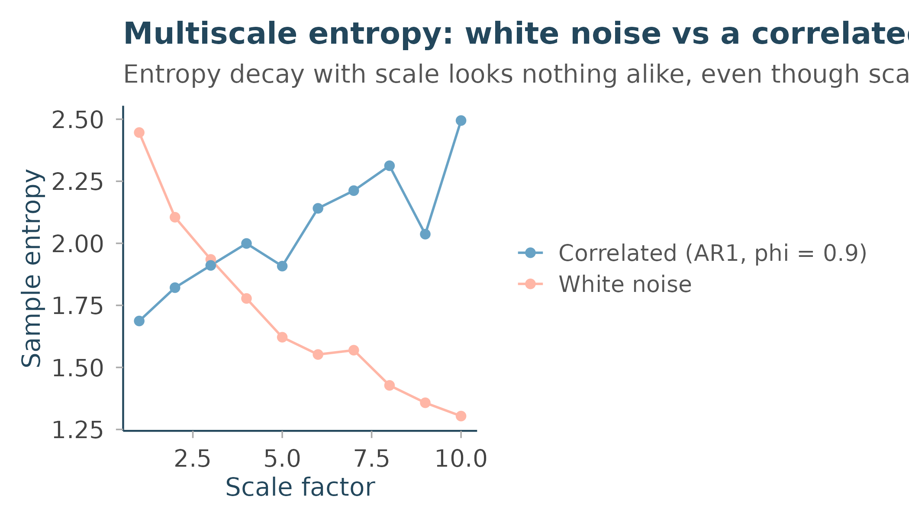

# Entropy and multiscale complexity

``` r

library(Rtractor)
```

## Three entropy measures, three different questions

Rtractor’s entropy family answers three related but distinct questions:

- [`perm_entropy()`](https://rtractor.circadia-lab.uk/reference/perm_entropy.md)
  – how evenly distributed are the *ordinal patterns* (which of the last
  few points was biggest, second-biggest, and so on) in this series?
- [`sample_entropy()`](https://rtractor.circadia-lab.uk/reference/sample_entropy.md)
  – how likely is it that two short segments of this series, which match
  closely, continue to match one point further?
- [`multiscale_entropy()`](https://rtractor.circadia-lab.uk/reference/multiscale_entropy.md)
  – how does that same “likely to keep matching” question change as the
  series is progressively smoothed (coarse-grained) across a range of
  temporal scales?

The first two are single-scale, single-number summaries. The third is
where things get more interesting, and where the difference between
“random” and “complex” actually shows up.

## Sample entropy: template matching

[`sample_entropy()`](https://rtractor.circadia-lab.uk/reference/sample_entropy.md)
(Richman & Moorman 2000) compares every pair of length-`m` templates in
the series (excluding self-matches) within a fixed Chebyshev-distance
tolerance `sd(x) * r`, then does the same for length `m + 1`, and
reports `-log(matches at m+1 / matches at m)`. A series that’s mostly
unpredictable has few long matches relative to short ones, so
[`sample_entropy()`](https://rtractor.circadia-lab.uk/reference/sample_entropy.md)
is high; a very regular series keeps matching, so it’s low:

``` r

set.seed(1)
white_noise  <- rnorm(1000)
smooth_signal <- sin(seq(0, 40 * pi, length.out = 1000))

sample_entropy(white_noise)
#> [1] 2.450377
sample_entropy(smooth_signal)
#> [1] 0.2165497
```

## Why one number isn’t enough: the multiscale idea

Here’s the problem
[`multiscale_entropy()`](https://rtractor.circadia-lab.uk/reference/multiscale_entropy.md)
(Costa, Goldberger & Peng 2002) was built to solve. Compare two series
with very different *structure* but comparable single-scale entropy:
pure white noise, and an autoregressive (AR(1)) process with strong
positive autocorrelation –the latter is smoother and more predictable
point-to-point, but has real structure that plays out over multiple
points, not just one:

``` r

set.seed(1)
white_noise       <- rnorm(2000)
correlated_signal <- as.numeric(
  stats::filter(rnorm(2000), filter = 0.9, method = "recursive")
)
```

[`multiscale_entropy()`](https://rtractor.circadia-lab.uk/reference/multiscale_entropy.md)
coarse-grains the series (non-overlapping block-averaging) at each
integer scale factor from `1` up to `scale_max`, and computes
[`sample_entropy()`](https://rtractor.circadia-lab.uk/reference/sample_entropy.md)
on each coarse-grained version – crucially, using a tolerance held
*fixed* relative to the **original** series’ standard deviation at every
scale, not each coarse-grained series’ own (shrinking) standard
deviation. That’s the detail that makes entropy values comparable across
scales at all; see
[`?multiscale_entropy`](https://rtractor.circadia-lab.uk/reference/multiscale_entropy.md).

``` r

mse_white <- multiscale_entropy(white_noise, scale_max = 10)
mse_corr  <- multiscale_entropy(correlated_signal, scale_max = 10)

round(mse_white$mse, 3)
#>  [1] 2.446 2.105 1.935 1.778 1.622 1.552 1.569 1.428 1.358 1.304
round(mse_corr$mse, 3)
#>  [1] 1.687 1.821 1.911 1.999 1.908 2.141 2.212 2.313 2.037 2.495
```

Look at the *shape* of these two profiles, not just the scale-1 value.
White noise’s entropy decreases steadily as the scale grows – coarse-
graining destroys the (already trivial) point-to-point unpredictability,
leaving less and less structure for
[`sample_entropy()`](https://rtractor.circadia-lab.uk/reference/sample_entropy.md)
to find. The correlated signal starts lower (it’s more locally
predictable than white noise at scale 1) but its entropy *doesn’t* decay
the same way – coarse- graining doesn’t destroy its structure nearly as
fast, because that structure plays out over several points rather than
just one. By scale 5 or so, the correlated signal’s entropy has
overtaken white noise’s.

``` r

library(ggplot2)

mse_df <- data.frame(
  scale = c(mse_white$scale, mse_corr$scale),
  mse   = c(mse_white$mse, mse_corr$mse),
  series = rep(c("White noise", "Correlated (AR1, phi = 0.9)"), each = 10)
)

ggplot(mse_df, aes(scale, mse, colour = series)) +
  geom_line() +
  geom_point() +
  scale_colour_manual(values = unname(rtractor_palette("core")[c("steel_blue", "coral")])) +
  labs(
    title = "Multiscale entropy: white noise vs a correlated signal",
    subtitle = "Entropy decay with scale looks nothing alike, even though scale-1 values are similar",
    x = "Scale factor", y = "Sample entropy", colour = NULL
  ) +
  theme_rtractor()
```



This is the whole point of the multiscale approach: a single-scale
entropy value can’t tell “genuinely unpredictable” apart from
“structured across multiple scales” – you need the *profile* across
scales to see the difference. This is the same reasoning behind why
physiological signals (heart rate, EEG, gait) are usually characterised
by their full MSE curve rather than a single entropy number, in the
original Costa et al. line of work.

## Choosing `m` and `r`

Both
[`sample_entropy()`](https://rtractor.circadia-lab.uk/reference/sample_entropy.md)
and
[`multiscale_entropy()`](https://rtractor.circadia-lab.uk/reference/multiscale_entropy.md)
default to `m` = `2`, `r` = `0.15` – the standard convention from Costa
et al.’s original MSE papers, and a reasonable starting point for most
physiological time series. `m` is the template length being compared;
`r` is the tolerance as a fraction of the series’ own standard
deviation. Larger `r` tolerates more noise before two templates stop
“matching,” which tends to reduce entropy overall; smaller `m` needs
less data to estimate reliably but captures less structure. Changing
either changes the absolute entropy values, so keep them fixed across
signals you intend to compare.

## References

Bandt C, Pompe B. Permutation entropy: a natural complexity measure for
time series. Phys Rev Lett 2002;88:174102.

Richman JS, Moorman JR. Physiological time-series analysis using
approximate entropy and sample entropy. Am J Physiol Heart Circ Physiol
2000;278(6):H2039-H2049.

Costa M, Goldberger AL, Peng CK. Multiscale entropy analysis of complex
physiologic time series. Phys Rev Lett 2002;89:068102.
