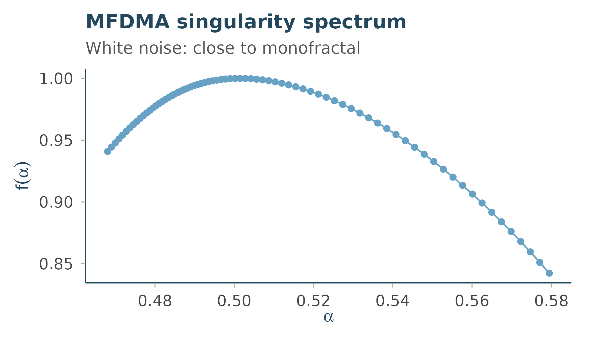

# Getting started with Rtractor

``` r

library(Rtractor)
```

## Overview

**Rtractor** is the complexity/statistical-physics layer of the Circadia
Lab R ecosystem: a shared home for the nonlinear dynamics and
complex-systems measures (entropy, fractal dimension, multifractal
spectra, recurrence quantification) that would otherwise get
reimplemented piecemeal inside signal-specific packages like `mrpheus`,
`zeitR`, and `dynR`.

Like the rest of the ecosystem, Rtractor is **signal-agnostic**: every
function accepts a plain numeric vector regardless of where it came from
– EEG, actigraphy, BOLD, HRV, or anything else – rather than assuming a
specific acquisition modality or staging scheme.

Where a solid reference implementation exists, Rtractor wraps it (via
Rcpp) rather than re-deriving the algorithm from scratch, to preserve
numerical parity with the original methods literature. Where no license
permits a direct wrap, functions are clean-room reimplementations from
the published algorithm, validated against the reference implementation
on synthetic test data. See `inst/COPYRIGHTS` for the full provenance of
every function.

This article walks through everything currently implemented, organised
by family. See “What isn’t here yet” at the end for what’s still in
progress.

## Installation

``` r

# install.packages("remotes")
remotes::install_github("circadia-bio/Rtractor")
```

## Example data

A couple of synthetic series to work with throughout: white noise (an
uncorrelated signal, the classic complexity-measures benchmark) and a
random walk (its cumulative sum, the other classic benchmark).

``` r

set.seed(1)
white_noise <- rnorm(4000)
random_walk <- cumsum(white_noise)
```

## Fractal & multifractal analysis

### Detrended Fluctuation Analysis

[`dfa()`](https://rtractor.circadia-lab.uk/reference/dfa.md) estimates
the scaling exponent alpha of a time series (Peng et al. 1994). By
default it treats `x` as an increment series and integrates it
internally – the standard DFA convention – so white noise gives the
textbook benchmark of alpha ~ 0.5:

``` r

dfa(white_noise)$alpha
#> [1] 0.4773237
```

Feeding a random walk through the same default pipeline amounts to
*double* integration – the other classic benchmark, alpha ~ 1.5:

``` r

dfa(random_walk)$alpha
#> [1] 1.473855
```

### Higuchi Fractal Dimension

[`higuchi_fd()`](https://rtractor.circadia-lab.uk/reference/higuchi_fd.md)
estimates fractal dimension from curve length at increasing sub-sampling
intervals (Higuchi 1988). White noise is space-filling (HFD ~ 2); a
smooth periodic signal is line-like (HFD ~ 1):

``` r

higuchi_fd(white_noise, k_max = 10)$hfd
#> [1] 2.000681

smooth_signal <- sin(seq(0, 40 * pi, length.out = 4000))
higuchi_fd(smooth_signal, k_max = 10)$hfd
#> [1] 1.002216
```

### Multifractal Detrending Moving Average (MFDMA)

[`mfdma()`](https://rtractor.circadia-lab.uk/reference/mfdma.md) extends
DFA to a spectrum of scaling exponents across multifractal orders `q`
(Gu & Zhou 2010), returning the singularity spectrum f(alpha):

``` r

mf <- mfdma(white_noise, n_min = 10, n_max = 400, n_scales = 20)
plot(mf$alpha, mf$f, type = "b", xlab = "alpha", ylab = "f(alpha)")
```


White noise is close to monofractal, so the spectrum collapses to a
narrow range around alpha ~ 0.5 with f(alpha) peaking near 1.

### Chhabra-Jensen multifractal spectrum

[`chhabra_jensen()`](https://rtractor.circadia-lab.uk/reference/chhabra_jensen.md)
estimates the same kind of spectrum via direct box-counting (Chhabra &
Jensen 1989) rather than detrended fluctuations. It needs a strictly
positive series with a dyadic (power-of-two-friendly) length:

``` r

positive_series <- abs(rnorm(1024)) + 0.01
cj <- chhabra_jensen(positive_series, scales = 1:6)
plot(cj$alpha, cj$falpha, type = "b", xlab = "alpha", ylab = "f(alpha)")
```


Each `q` value’s `alpha`/`falpha`/`Dq` estimate comes with an R-squared
(`r_squared_alpha`, `r_squared_falpha`, `r_squared_Dq`) – worth checking
before trusting any individual point, especially near the edges of the
`q` range.

## Nonlinear time-domain features

Three fast, cheap-to-compute descriptors centralised from `mrpheus`’s
AASM staging feature pipeline (itself a validated port of the
`antropy`/YASA Python feature set):

``` r

petrosian_fd(white_noise)
#> [1] 1.02932

hjorth_parameters(white_noise)
#> $mobility
#> [1] 1.407727
#> 
#> $complexity
#> [1] 1.226695

num_zerocross(white_noise)
#> [1] 1958
```

[`petrosian_fd()`](https://rtractor.circadia-lab.uk/reference/petrosian_fd.md)
is a fast proxy for irregularity based on sign changes in the first
difference.
[`hjorth_parameters()`](https://rtractor.circadia-lab.uk/reference/hjorth_parameters.md)
returns mobility (a proxy for mean frequency) and complexity (a proxy
for bandwidth) from variance ratios of successive differences – note
this uses Bessel-corrected variance, matching R’s
[`var()`](https://rdrr.io/r/stats/cor.html) convention, which differs
slightly from `antropy`’s population-variance convention for short
series (see
[`?hjorth_parameters`](https://rtractor.circadia-lab.uk/reference/hjorth_parameters.md)).
[`num_zerocross()`](https://rtractor.circadia-lab.uk/reference/num_zerocross.md)
simply counts sign changes.

## Entropy

[`perm_entropy()`](https://rtractor.circadia-lab.uk/reference/perm_entropy.md)
estimates complexity from the distribution of ordinal patterns in the
series (Bandt & Pompe 2002), normalised to `[0, 1]` by default:

``` r

perm_entropy(white_noise)
#> [1] 0.9996287
perm_entropy(smooth_signal)
#> [1] 0.4219911
```

White noise has near-maximal permutation entropy (every ordinal pattern
is close to equally likely); the smooth periodic signal has much lower
entropy (a small number of patterns dominate).

## Recurrence quantification analysis (RQA)

[`recurrence_microstate_entropy()`](https://rtractor.circadia-lab.uk/reference/recurrence_microstate_entropy.md)
implements a parameter-free approach to recurrence analysis (Corso et
al. 2018): rather than picking a vicinity threshold epsilon by hand, it
searches for the threshold that *maximises* the Shannon entropy of the
recurrence microstate distribution.

``` r

windowed_signal <- (sin(seq(0, 20 * pi, length.out = 300)) + 1) / 2
recurrence_microstate_entropy(windowed_signal, seed = 1)
#> $microstate_probs
#>   [1] 5.048889e-01 1.544444e-02 0.000000e+00 1.611111e-03 1.688889e-02
#>   [6] 5.555556e-05 2.055556e-03 4.555556e-03 0.000000e+00 2.000000e-03
#>  [11] 0.000000e+00 9.388889e-03 0.000000e+00 0.000000e+00 0.000000e+00
#>  [16] 4.000000e-03 0.000000e+00 0.000000e+00 0.000000e+00 0.000000e+00
#>  [21] 0.000000e+00 0.000000e+00 0.000000e+00 0.000000e+00 0.000000e+00
#>  [26] 0.000000e+00 0.000000e+00 0.000000e+00 0.000000e+00 0.000000e+00
#>  [31] 0.000000e+00 2.666667e-03 0.000000e+00 0.000000e+00 0.000000e+00
#>  [36] 0.000000e+00 2.500000e-03 0.000000e+00 1.050000e-02 4.388889e-03
#>  [41] 0.000000e+00 0.000000e+00 0.000000e+00 0.000000e+00 0.000000e+00
#>  [46] 0.000000e+00 0.000000e+00 2.222222e-04 0.000000e+00 0.000000e+00
#>  [51] 0.000000e+00 0.000000e+00 0.000000e+00 0.000000e+00 0.000000e+00
#>  [56] 2.666667e-03 0.000000e+00 0.000000e+00 0.000000e+00 0.000000e+00
#>  [61] 0.000000e+00 0.000000e+00 0.000000e+00 3.444444e-03 1.627778e-02
#>  [66] 2.222222e-04 0.000000e+00 0.000000e+00 0.000000e+00 0.000000e+00
#>  [71] 0.000000e+00 0.000000e+00 2.388889e-03 4.166667e-03 0.000000e+00
#>  [76] 4.722222e-03 0.000000e+00 0.000000e+00 0.000000e+00 0.000000e+00
#>  [81] 0.000000e+00 0.000000e+00 0.000000e+00 0.000000e+00 0.000000e+00
#>  [86] 0.000000e+00 0.000000e+00 0.000000e+00 0.000000e+00 0.000000e+00
#>  [91] 0.000000e+00 2.166667e-03 0.000000e+00 0.000000e+00 0.000000e+00
#>  [96] 1.177778e-02 0.000000e+00 0.000000e+00 0.000000e+00 0.000000e+00
#> [101] 0.000000e+00 0.000000e+00 0.000000e+00 0.000000e+00 0.000000e+00
#> [106] 0.000000e+00 0.000000e+00 0.000000e+00 0.000000e+00 0.000000e+00
#> [111] 0.000000e+00 0.000000e+00 0.000000e+00 0.000000e+00 0.000000e+00
#> [116] 0.000000e+00 0.000000e+00 0.000000e+00 0.000000e+00 0.000000e+00
#> [121] 0.000000e+00 0.000000e+00 0.000000e+00 0.000000e+00 0.000000e+00
#> [126] 0.000000e+00 0.000000e+00 4.055556e-03 0.000000e+00 0.000000e+00
#> [131] 0.000000e+00 0.000000e+00 0.000000e+00 0.000000e+00 0.000000e+00
#> [136] 0.000000e+00 0.000000e+00 0.000000e+00 0.000000e+00 0.000000e+00
#> [141] 0.000000e+00 0.000000e+00 0.000000e+00 0.000000e+00 0.000000e+00
#> [146] 0.000000e+00 0.000000e+00 0.000000e+00 0.000000e+00 0.000000e+00
#> [151] 0.000000e+00 0.000000e+00 0.000000e+00 0.000000e+00 0.000000e+00
#> [156] 0.000000e+00 0.000000e+00 0.000000e+00 0.000000e+00 0.000000e+00
#> [161] 0.000000e+00 0.000000e+00 0.000000e+00 0.000000e+00 0.000000e+00
#> [166] 0.000000e+00 0.000000e+00 0.000000e+00 0.000000e+00 0.000000e+00
#> [171] 0.000000e+00 0.000000e+00 0.000000e+00 0.000000e+00 0.000000e+00
#> [176] 0.000000e+00 0.000000e+00 0.000000e+00 0.000000e+00 0.000000e+00
#> [181] 0.000000e+00 0.000000e+00 0.000000e+00 0.000000e+00 0.000000e+00
#> [186] 0.000000e+00 0.000000e+00 0.000000e+00 0.000000e+00 0.000000e+00
#> [191] 0.000000e+00 0.000000e+00 2.555556e-03 0.000000e+00 0.000000e+00
#> [196] 0.000000e+00 0.000000e+00 0.000000e+00 0.000000e+00 0.000000e+00
#> [201] 8.833333e-03 3.833333e-03 0.000000e+00 1.666667e-04 0.000000e+00
#> [206] 0.000000e+00 0.000000e+00 0.000000e+00 0.000000e+00 0.000000e+00
#> [211] 0.000000e+00 0.000000e+00 0.000000e+00 0.000000e+00 0.000000e+00
#> [216] 0.000000e+00 0.000000e+00 2.888889e-03 0.000000e+00 3.944444e-03
#> [221] 0.000000e+00 0.000000e+00 0.000000e+00 4.611111e-03 0.000000e+00
#> [226] 0.000000e+00 0.000000e+00 0.000000e+00 0.000000e+00 0.000000e+00
#> [231] 0.000000e+00 0.000000e+00 0.000000e+00 0.000000e+00 0.000000e+00
#> [236] 0.000000e+00 0.000000e+00 0.000000e+00 0.000000e+00 0.000000e+00
#> [241] 0.000000e+00 0.000000e+00 0.000000e+00 0.000000e+00 0.000000e+00
#> [246] 0.000000e+00 0.000000e+00 0.000000e+00 0.000000e+00 0.000000e+00
#> [251] 0.000000e+00 0.000000e+00 0.000000e+00 0.000000e+00 1.000000e-03
#> [256] 1.694444e-02 1.661111e-02 0.000000e+00 0.000000e+00 0.000000e+00
#> [261] 1.111111e-04 0.000000e+00 0.000000e+00 0.000000e+00 0.000000e+00
#> [266] 0.000000e+00 0.000000e+00 0.000000e+00 0.000000e+00 0.000000e+00
#> [271] 0.000000e+00 0.000000e+00 0.000000e+00 0.000000e+00 0.000000e+00
#> [276] 0.000000e+00 0.000000e+00 0.000000e+00 0.000000e+00 0.000000e+00
#> [281] 0.000000e+00 0.000000e+00 0.000000e+00 0.000000e+00 0.000000e+00
#> [286] 0.000000e+00 0.000000e+00 0.000000e+00 2.944444e-03 0.000000e+00
#> [291] 0.000000e+00 0.000000e+00 4.944444e-03 0.000000e+00 4.388889e-03
#> [296] 1.666667e-04 0.000000e+00 0.000000e+00 0.000000e+00 0.000000e+00
#> [301] 0.000000e+00 0.000000e+00 0.000000e+00 0.000000e+00 0.000000e+00
#> [306] 0.000000e+00 0.000000e+00 0.000000e+00 0.000000e+00 0.000000e+00
#> [311] 2.833333e-03 1.088889e-02 0.000000e+00 0.000000e+00 0.000000e+00
#> [316] 0.000000e+00 0.000000e+00 0.000000e+00 0.000000e+00 4.166667e-03
#> [321] 5.555556e-05 0.000000e+00 0.000000e+00 0.000000e+00 0.000000e+00
#> [326] 0.000000e+00 0.000000e+00 0.000000e+00 0.000000e+00 0.000000e+00
#> [331] 0.000000e+00 0.000000e+00 0.000000e+00 0.000000e+00 0.000000e+00
#> [336] 0.000000e+00 0.000000e+00 0.000000e+00 0.000000e+00 0.000000e+00
#> [341] 0.000000e+00 0.000000e+00 0.000000e+00 0.000000e+00 0.000000e+00
#> [346] 0.000000e+00 0.000000e+00 0.000000e+00 0.000000e+00 0.000000e+00
#> [351] 0.000000e+00 0.000000e+00 0.000000e+00 0.000000e+00 0.000000e+00
#> [356] 0.000000e+00 0.000000e+00 0.000000e+00 0.000000e+00 0.000000e+00
#> [361] 0.000000e+00 0.000000e+00 0.000000e+00 0.000000e+00 0.000000e+00
#> [366] 0.000000e+00 0.000000e+00 0.000000e+00 0.000000e+00 0.000000e+00
#> [371] 0.000000e+00 0.000000e+00 0.000000e+00 0.000000e+00 0.000000e+00
#> [376] 0.000000e+00 0.000000e+00 0.000000e+00 0.000000e+00 0.000000e+00
#> [381] 0.000000e+00 0.000000e+00 0.000000e+00 1.666667e-04 2.500000e-03
#> [386] 0.000000e+00 0.000000e+00 0.000000e+00 0.000000e+00 0.000000e+00
#> [391] 0.000000e+00 0.000000e+00 0.000000e+00 0.000000e+00 0.000000e+00
#> [396] 0.000000e+00 0.000000e+00 0.000000e+00 0.000000e+00 0.000000e+00
#> [401] 0.000000e+00 0.000000e+00 0.000000e+00 0.000000e+00 0.000000e+00
#> [406] 0.000000e+00 0.000000e+00 0.000000e+00 0.000000e+00 0.000000e+00
#> [411] 0.000000e+00 0.000000e+00 0.000000e+00 0.000000e+00 0.000000e+00
#> [416] 0.000000e+00 9.111111e-03 0.000000e+00 0.000000e+00 0.000000e+00
#> [421] 4.722222e-03 0.000000e+00 1.111111e-04 0.000000e+00 0.000000e+00
#> [426] 0.000000e+00 0.000000e+00 0.000000e+00 0.000000e+00 0.000000e+00
#> [431] 0.000000e+00 0.000000e+00 0.000000e+00 0.000000e+00 0.000000e+00
#> [436] 0.000000e+00 2.833333e-03 0.000000e+00 4.666667e-03 5.111111e-03
#> [441] 0.000000e+00 0.000000e+00 0.000000e+00 1.222222e-03 0.000000e+00
#> [446] 0.000000e+00 0.000000e+00 1.916667e-02 4.555556e-03 0.000000e+00
#> [451] 0.000000e+00 0.000000e+00 0.000000e+00 0.000000e+00 0.000000e+00
#> [456] 0.000000e+00 4.166667e-03 3.888889e-04 0.000000e+00 0.000000e+00
#> [461] 0.000000e+00 0.000000e+00 0.000000e+00 0.000000e+00 0.000000e+00
#> [466] 0.000000e+00 0.000000e+00 0.000000e+00 0.000000e+00 0.000000e+00
#> [471] 0.000000e+00 0.000000e+00 2.500000e-03 1.150000e-02 0.000000e+00
#> [476] 4.888889e-03 0.000000e+00 0.000000e+00 0.000000e+00 2.222222e-04
#> [481] 4.388889e-03 0.000000e+00 0.000000e+00 0.000000e+00 0.000000e+00
#> [486] 0.000000e+00 0.000000e+00 0.000000e+00 2.222222e-04 0.000000e+00
#> [491] 0.000000e+00 0.000000e+00 0.000000e+00 0.000000e+00 0.000000e+00
#> [496] 0.000000e+00 2.944444e-03 0.000000e+00 0.000000e+00 0.000000e+00
#> [501] 1.183333e-02 0.000000e+00 4.888889e-03 1.666667e-04 4.277778e-03
#> [506] 4.888889e-03 0.000000e+00 1.800000e-02 4.388889e-03 1.666667e-04
#> [511] 1.783333e-02 1.232222e-01
#> 
#> $entropy_max
#> [1] 2.392682
#> 
#> $eps_max
#> [1] 0.19624
```

## Colour palette & theme

Rtractor ships its own colour palette and `ggplot2` theme, visually
distinct from `circadia`’s (softer, more pastel) so figures from each
package are recognisable at a glance:

``` r

rtractor_palette()
#>      coral      cream       sage steel_blue        ink 
#>  "#FFB6A6"  "#FFEBD3"  "#9BCEC1"  "#67A2C5"  "#23475C"
rtractor_palette("core")
#>      coral      cream       sage steel_blue 
#>  "#FFB6A6"  "#FFEBD3"  "#9BCEC1"  "#67A2C5"
```

``` r

library(ggplot2)

mf_df <- data.frame(alpha = mf$alpha, f = mf$f)

ggplot(mf_df, aes(alpha, f)) +
  geom_point(colour = rtractor_palette("core")[["steel_blue"]], size = 2) +
  geom_line(colour = rtractor_palette("core")[["steel_blue"]]) +
  labs(
    title = "MFDMA singularity spectrum",
    subtitle = "White noise: close to monofractal",
    x = expression(alpha), y = expression(f(alpha))
  ) +
  theme_rtractor()
```



## What isn’t here yet

Several planned families aren’t implemented yet:

- **Lyapunov exponents** (`R/lyapunov.R`) – Rosenstein and Wolf methods
  for the largest Lyapunov exponent.
- **Multiscale metrics** (`R/multiscale.R`) – multiscale entropy and
  refined composite multiscale entropy, built on the entropy family
  applied at each coarse-grained scale.
- **General RQA measures** (`R/rqa.R`) – the recurrence matrix itself
  and its derived quantifiers (determinism, laminarity, recurrence rate,
  trapping time).
  [`recurrence_microstate_entropy()`](https://rtractor.circadia-lab.uk/reference/recurrence_microstate_entropy.md)
  is a threshold-selection tool, not a replacement for these.
- **Phase-space embedding** (`R/embed.R`) – time-delay embedding, and
  delay/dimension estimation, needed by the Lyapunov and RQA families
  above.

See `NEWS.md` for progress, or the package’s GitHub repository for the
current status of reference code for each.
