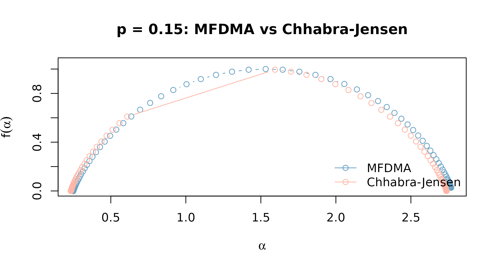

# Multifractal methods: MFDMA vs Chhabra-Jensen

``` r

library(Rtractor)
```

## Two estimators, one underlying idea

Rtractor ships two multifractal spectrum estimators:
[`mfdma()`](https://rtractor.circadia-lab.uk/reference/mfdma.md) (Gu &
Zhou 2010) and
[`chhabra_jensen()`](https://rtractor.circadia-lab.uk/reference/chhabra_jensen.md)
(Chhabra & Jensen 1989). Both try to answer the same question – does
this time series need more than one scaling exponent to describe it, and
if so, what’s the full spectrum of exponents present? – but they get
there differently.

[`mfdma()`](https://rtractor.circadia-lab.uk/reference/mfdma.md) is a
multifractal generalisation of DFA: it detrends the series against a
moving average at a range of scales, then looks at how the q-th order
fluctuation function scales with segment size.
[`chhabra_jensen()`](https://rtractor.circadia-lab.uk/reference/chhabra_jensen.md)
instead treats the series as a measure and does direct box-counting,
avoiding the Legendre transform that
[`mfdma()`](https://rtractor.circadia-lab.uk/reference/mfdma.md) (and
MF-DFA) rely on.

That difference matters in practice. França et al. (2018) benchmarked
MF-DFA, MF-DMA, and Chhabra-Jensen against each other on both simulated
and human intracranial EEG data, and found Chhabra-Jensen the most
stable of the three across repeated epochs of the same underlying signal
– the reason it’s implemented here alongside
[`mfdma()`](https://rtractor.circadia-lab.uk/reference/mfdma.md), rather
than reaching for MF-DFA. See
[`?chhabra_jensen`](https://rtractor.circadia-lab.uk/reference/chhabra_jensen.md)
for the full reference.

## Ground truth, not just plausible-looking data

It’s easy to run a multifractal estimator on
[`rnorm()`](https://rdrr.io/r/stats/Normal.html) and see *some* output,
but that doesn’t tell you whether the estimator is actually detecting
multifractality correctly – white noise is close to monofractal, so a
badly-behaved estimator could still produce a narrow-looking spectrum
purely by chance.

[`pmodel()`](https://rtractor.circadia-lab.uk/reference/pmodel.md)
solves this by generating a p-model binomial cascade (Meneveau &
Sreenivasan 1987) whose multifractal properties are directly controlled
by its `p` parameter: values near `0.5` are essentially monofractal, and
values far from `0.5` are strongly multifractal. This gives both
estimators a signal with **known** ground truth to be checked against,
rather than just a signal that happens to look complex.

``` r

y_calm   <- pmodel(8192, p = 0.48, seed = 1)  # near-monofractal
y_multi  <- pmodel(8192, p = 0.15, seed = 1)  # multifractal
y_strong <- pmodel(8192, p = 0.05, seed = 1)  # strongly multifractal
```

Both estimators expect the *raw* p-model output directly –
[`mfdma()`](https://rtractor.circadia-lab.uk/reference/mfdma.md) and
[`chhabra_jensen()`](https://rtractor.circadia-lab.uk/reference/chhabra_jensen.md)
each do their own internal integration/box-counting, so don’t difference
or log-transform it first.

## MFDMA on the ground-truth series

``` r

mf_calm   <- mfdma(y_calm,   n_min = 10, n_max = 400, n_scales = 25)
mf_multi  <- mfdma(y_multi,  n_min = 10, n_max = 400, n_scales = 25)
mf_strong <- mfdma(y_strong, n_min = 10, n_max = 400, n_scales = 25)

widths_mfdma <- c(
  calm   = diff(range(mf_calm$alpha)),
  multi  = diff(range(mf_multi$alpha)),
  strong = diff(range(mf_strong$alpha))
)
widths_mfdma
#>       calm      multi     strong 
#> 0.01884055 2.51858115 4.29434619
```

The estimated spectrum width increases monotonically as `p` moves away
from `0.5`, exactly as the underlying cascade predicts –
[`mfdma()`](https://rtractor.circadia-lab.uk/reference/mfdma.md) is
genuinely picking up the multifractal structure, not just returning a
wide spectrum regardless of input.

## Chhabra-Jensen on the same series

``` r

cj_calm   <- chhabra_jensen(y_calm,   scales = 1:11)
cj_multi  <- chhabra_jensen(y_multi,  scales = 1:11)
cj_strong <- chhabra_jensen(y_strong, scales = 1:11)

widths_cj <- c(
  calm   = diff(range(cj_calm$alpha)),
  multi  = diff(range(cj_multi$alpha)),
  strong = diff(range(cj_strong$alpha))
)
widths_cj
#>       calm      multi     strong 
#> 0.04389655 2.50250019 4.24792751
```

Same pattern, and the two estimators land within a few percent of each
other on the same data – independent cross-validation, not just each
method being internally consistent with itself.

``` r

plot(
  mf_multi$alpha, mf_multi$f, type = "b", col = rtractor_palette("core")[["steel_blue"]],
  xlab = expression(alpha), ylab = expression(f(alpha)),
  main = "p = 0.15: MFDMA vs Chhabra-Jensen",
  ylim = c(0, 1.05)
)
lines(cj_multi$alpha, cj_multi$falpha, type = "b", col = rtractor_palette("core")[["coral"]])
legend(
  "bottomright", legend = c("MFDMA", "Chhabra-Jensen"),
  col = rtractor_palette("core")[c("steel_blue", "coral")], lty = 1, pch = 1, bty = "n"
)
```



[`chhabra_jensen()`](https://rtractor.circadia-lab.uk/reference/chhabra_jensen.md)’s
spectrum also has a theoretical constraint worth knowing about: the peak
height, `max(falpha)`, should sit close to `1` – the fractal dimension
of the one-dimensional support the measure lives on. That’s a useful
sanity check independent of the p-model comparison above:

``` r

max(cj_multi$falpha)
#> [1] 0.9945943
```

## Which one should I use?

- If you want the more *stable* estimate across repeated epochs of the
  same signal, and your series can be made strictly positive (or you’re
  willing to apply a sigmoid transform), reach for
  [`chhabra_jensen()`](https://rtractor.circadia-lab.uk/reference/chhabra_jensen.md)
  first – see França et al. (2018) for why.
- If your series already has a natural DFA-style workflow around it, or
  you need
  [`mfdma()`](https://rtractor.circadia-lab.uk/reference/mfdma.md)’s
  cross-package parity with other MF-DFA-family tools,
  [`mfdma()`](https://rtractor.circadia-lab.uk/reference/mfdma.md) is
  the more familiar entry point.
- Either way, check the R-squared / fit diagnostics each function
  returns (`r_squared_alpha`, `r_squared_falpha`, `r_squared_Dq` for
  [`chhabra_jensen()`](https://rtractor.circadia-lab.uk/reference/chhabra_jensen.md))
  before trusting an individual `q` value’s estimate, especially near
  the edges of the `q` range.

## References

Chhabra A, Jensen RV. Direct determination of the f(alpha) singularity
spectrum. Phys Rev Lett 1989;62:1327-1330.

Gu GF, Zhou WX. Detrending moving average algorithm for multifractals.
Phys Rev E 2010;82:011136.

Meneveau C, Sreenivasan KR. Simple multifractal cascade model for fully
developed turbulence. Phys Rev Lett 1987;59:1424-1427.

Franca LGS, Miranda JGV, Leite M, Sharma NK, Walker MC, Lemieux L, Wang
Y. Fractal and multifractal properties of electrographic recordings of
human brain activity: toward its use as a signal feature for machine
learning in clinical applications. Front Physiol 2018;9:1767.
